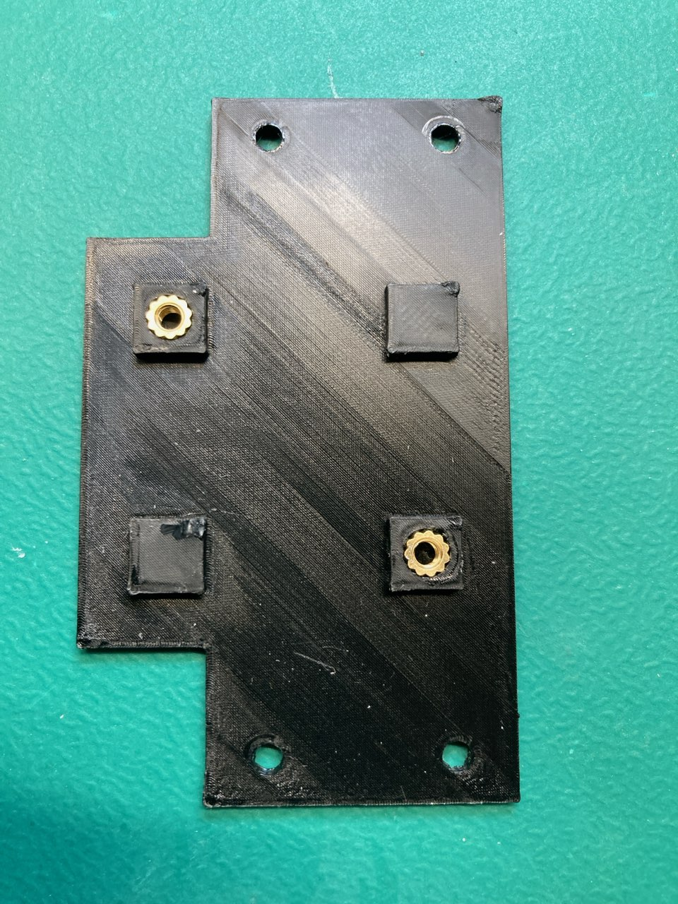
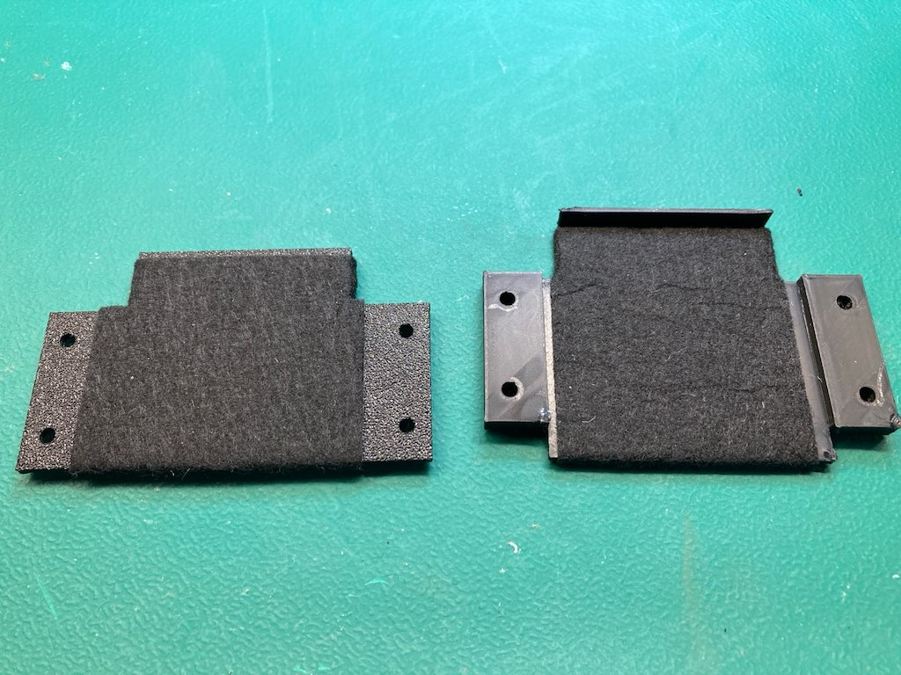

# TapTo Setup for NeoGeo MV-IC (4/6 slot cabinets)

* [Overview](#overview)
* [Required Parts](#required-parts)
* [Building](#building)
    + [MV-IC](#mv-ic)
    + [3D Printed Parts](#3d-printed-parts)
    + [Install M3 Nuts](#install-m3-nuts)
    + [Install Felt](#install-felt)
    + [Install Pin Header on NFC Reader](#install-pin-header-on-nfc-reader)
    + [Test NFC Reader with TapTo](#test-nfc-reader-with-tapto)
    + [Install NFC Reader](#install-nfc-reader)

## Overview
[TapTo](https://github.com/TapToCommunity/tapto) is an open source system for launching games and scripted actions using physical objects like NFC cards. Its mainly used as an add-on with [MiSTer FPGA](https://github.com/MiSTer-devel/Wiki_MiSTer/wiki) to allow tap to launch games using NFC cards.

4 and 6 slot NeoGeo arcade cabinets have an existing cut out in their control panel to support using a NeoGeo memory card.  This makes a great location to setup a TapTo interface if you are running a MiSTer FPGA with a [MiSTercade](https://misteraddons.com/collections/arcade/products/mistercade) inside your cabinet instead of a NeoGeo board.

This is what the modified MV-IC looks like outside of the cabinet 

## Required Parts

* [NeoGeo MV-IC board](images/mv-ic-original.jpg)
* [HiLetgo PN532 NFC](https://www.amazon.com/dp/B01I1J17LC)
* [NFC Cards](https://www.amazon.com/dp/B0CLKM7483)
* [USB-to-TTL Serial Cable](https://www.amazon.com/gp/product/B00DJUHGHI)
* [M3 x 3 x 5mm 3D Printing Brass Nuts](https://www.amazon.com/gp/product/B0C4GDBXML)
* [M3 x 4mm Screws](https://www.amazon.com/gp/product/B0B6HV8YZL)
* [Felt Tape 1mm thick](https://www.amazon.com/gp/product/B07CPN1WRS)
* 3D printer
* Soldering Iron

The items linked above are what I used.

## Building

### MV-IC
The original MV-IC should look like this 

Remove the 2 nuts/screws holding on the square plastic part that is used to guide the memory card into the PCMCIA slot.  The 3d printed parts will replace this plastic piece. 

### 3D Printed Parts
Use the STL file from the repo to print the 3d parts, which should look like this.

You will note the lip on the right side of the left part in the picture.  This is to prevent the NFC card from being inserted to far and damaging the pins of the PCMCIA slot.

If you want to make changes to the parts you can directly use/mess with the TinkerCAD version of it [here](https://www.tinkercad.com/things/htaqLKyCQPt-tapto-neogeo-mv-ic).

### Install M3 Nuts
Use a soldering iron to melt the M3 x 3 x 5mm nuts into place as seen here.  

They should be flush with the top of plastic stand-offs.

### Install Felt
Next install the felt tape strips as shown.

The part on the left is the underside of the part you just installed the nuts into.

Its advised you wrap the felt around the front edge where the card will be inserted.  The felt helps to provide a smooth insertion of the NFC card while also adding a bit of friction to prevent it from sliding out on its own.

### Install Pin Header on NFC Reader
The NFC reader should come with a set of right angle pin headers.  Install one of them as shown below.

### Test NFC Reader with TapTo
At this point I would advise verifying to you can get TapTo working with the NFC reader.

Wire up the USB-to-TTL cable with the NFC Reader.  The pinout for serial is on the silk screen on the *underside* of the board. Details on getting TapTo setup can be found on the [TapTo Wiki](https://tapto.wiki/Getting_Started), as well as info on how to program the NFC Cards.

I would suggest installing the TapTo phone app. It makes it really easy to configure TapTo and write cards.  Additionally, under settings in the phone app, change the Reader mode to `Insert`.  This makes so when you insert the card it will load the game, when you remove the card it will cause MiSTer to return to its main menu.

### Install NFC Reader
Using the M3 x 4mm screws, install the NFC reader onto the 3d printed part as show. 

At this point you can install the MV-IC back into your cabinet.  The lower 3d printed part should protrude a bit outside of the cabinet's control panel.  I designed it this way to make it easier to know when you have the NFC card lined up correctly for insertion without having to look under the control panel.